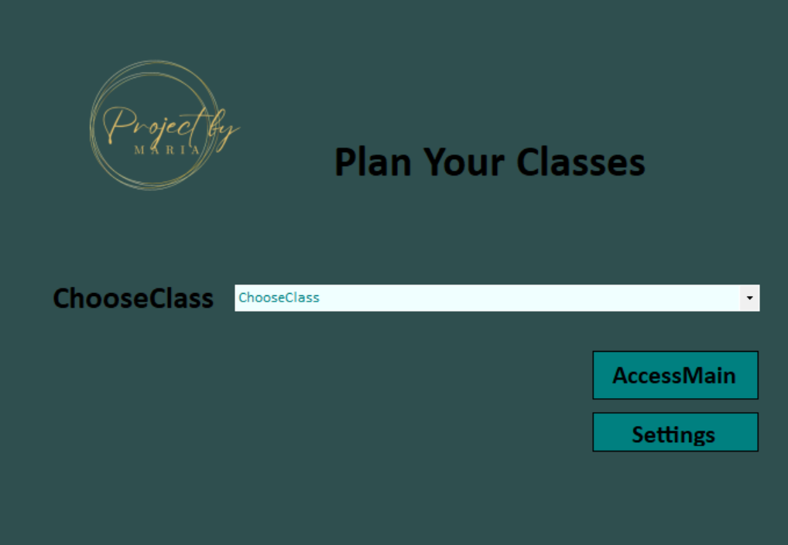

# School Management Scheduling System 
The School Scheduling System is a specialized software solution focused on optimizing the scheduling processes within educational institutions.

Project made using SQL, C# and .NET in Visual Studio and Microsoft SQL Server Management Studio.

## Table of Contents

- [Introduction](#introduction)
- [Features](#features)
- [Getting Started](#getting-started)
  - [Prerequisites](#prerequisites)
  - [Installation](#installation)
- [Usage](#usage)

## Introduction

This user-friendly system empowers administrators to efficiently manage class timetables, assignments, and classroom resources, ensuring a seamless and conflict-free educational environment

 

## Features

List the key features of your project.

- Streamlined Scheduling: Seamlessly create and manage class schedules, minimizing conflicts and maximizing resource utilization.
- Assignment: Professors can chooseto specific classes and subjects based on their expertise and availability.
- Classroom Allocation: Allocate classrooms and resources intelligently, avoiding double-bookings and overcrowding, also based on user's room preferrences.
- Customizable Constraints: Adapt the system to institution's unique scheduling constraints and requirements.
- Configuration Options: data base string and table names, room names and times available.

## Getting Started

### Prerequisites

Before you begin, ensure you have the following prerequisites installed on your system:

- **.NET Framework 5.0 (Optional as you can do the setup in VS)s**: The system is built using .NET, so you need to have .NET Framework 5.0 or later installed. You can download it from [here](https://dotnet.microsoft.com/download).
- **SQL Server**: The system relies on a SQL Server database to store and manage school data. You can install SQL Server locally or connect to a remote SQL Server instance.
- **SQL Database**: You will also need your own database with the specified constraints. [See database schema](https://github.com/mariad765/School_Management_Soft/blob/master/SqlQuery_1.sql).
- **Visual Studio**: While not mandatory, having Visual Studio installed can make development and testing more convenient. You can download Visual Studio from [here](https://visualstudio.microsoft.com/).
- **iTextSharp**: This library is used for PDF generation within the system. You can find more information and download it [here](https://www.nuget.org/packages/iTextSharp/).

### Installation


1. Clone the repository to your local machine:

   ```shell
   git clone https://github.com/mariad765/School_Management_Soft
   ```
 2. Open the project in Visual Studio.
 3. Build and run the project and access the settings to set up the database connection string and other specific variables like names of room, times.
 4. Make sure your database has the relevant [constrains](https://github.com/mariad765/School_Management_Soft/blob/master/SqlQuery_1.sql).

 ## Usage

### Managing Classes and Times


For this, you need to press the "Settings" button to enter the menu where you can do the setup for classes and database.
#### 1. Addind a Room:

- Click on the "Room" section in the Settings menu.
- You can modify the table by deleting roomss and adding new rooms.
- There are two collumns in the table. One can be used for small rooms/labs and the other can be used for bigger rooms like course rooms. 
- Click "Save" to add the changed.

#### 2. Editing a Class:

- Click on the "Room" section in the Settings menu.
- Click on the class/course you want to edit. WARNING this feature is still not set in the code as it is pretty much the same as for the "Room" section.
- Make the necessary changes and click "Save".

#### 3. Edit Time:

- Go to the "Time" section in the "Settings" menu.
- In the two textboxes write the start_time and the end_time for the institution. It must be an integer.
- Make the necessary changes and click "Save".

#### 4. Edit Database:

- Access the "Database" section in the "Settings" menu.
- Make the necessary changes to the database connection string, table names and other elements and click "Save"..

### Schedule Management

#### 1. Choose Class:

- In the "Plan Your Classes" section, choose the class from the dropdown menu.
 ##### How classes work:
 Each class in the institution must have an unique name. It can be something derived from Faculty name, year of study and additional domain name.
- After selecting the desired class, you can now press the "AcessMain" button to be able to introduce the preferences before downloading the schedule for that specific class.

#### 2. Choosing Preferrences:

- Navigate to the "AccessMain" section.
- The table shown will contain a list with all Prefessors, their subject and preferrences. There is no need to be guided by their preferences when choosing your own preferences as the soft will choose the best option for you when collisions occur.
- Enter your information in the textboxes.
- Choose preferred time and room. NOTE: the application will firstly search for a time up if the preferred time is not available in any room.
- Click "Submit" to enter your preferences in the table.
- Click "Next" to add another set of information.
- Click "Delete" to delete a selecte row from the table.
- Click "Finish" to generate a PDF with the schedule for the chose class.

### Additional information

#### The app was designed for admin use only. An admin can add as many prefessors as he wants or as many classes as needed. The application was designed to work on a local server as safty feature.
### Other database features


- Each class/course has an unique ID. For example a class from 8 pm can't have the same ID as a class at 5pm even if it is with the same professor, held at the same group of students in the same room.
- Each professor will have an nique ID generated using an encription function applied on the name and surname.
system when you are done to ensure the security of your account and data.
